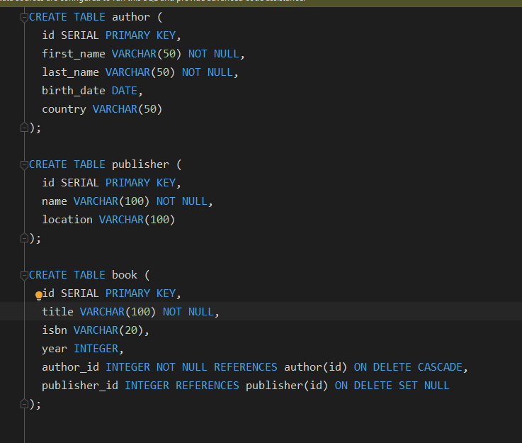
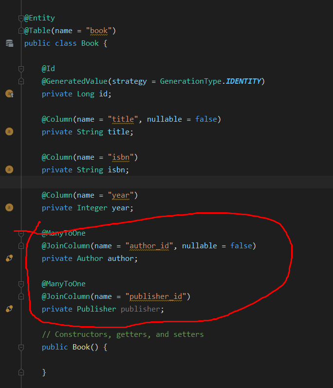
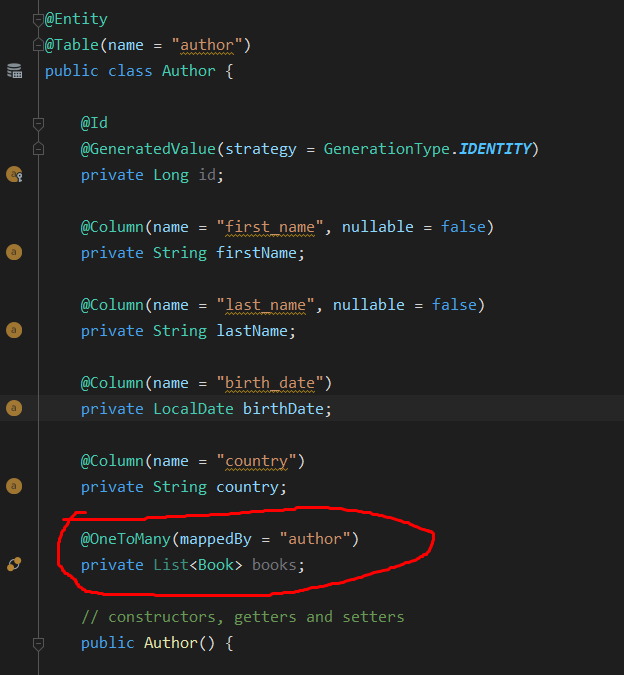
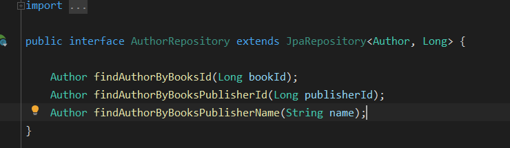

# Mám to borci

## Návod
Asi jsem pochopil Hibernate (ORM, který používáme). Snad tenhle návod s obrázkama pomůže i vám.

## Datovej model

Máme tři tabulky: author, book, publisher. Autor logicky má 0 až X knížek. Knížka může mít vydavatele. Když děláme classy s anotací entity, tak jsme tam dávali další anotace jako @OneToMany a @ManyToOne.
U ManyToOne referujeme cizí klíč z jiný tabulky. Konkrétně u knížek teda bude id autora a id vydavatele.

Musíme přímo specifikovat, o který sloupce v tabulce book jde, to je to @JoinColumn.
Pak musíme vytvořit model pro autor tabulku.

Tady přichází malinkej pojeb Hibernatu. Musíme udělat anotaci @OneToMany kde mappedBy referuje field private Author author v entitě Book (předchozí obrázek).
Nereferuje to ŽÁDNEJ SLOUPEC v databázi, je to čistě kvůli tomu, aby Hibernate chápal ten vztah. Díky tomuhle pak můžeme napsat krásný a jasný metody.

Tady máme author repository se 3 metodama, jejichž jména přesně popisujou, co ty metody dělají, proto vlastně vytváříme ty classy jako @Entity a píšeme další sračky jako @OneToMany a @ManyToOne.

## Author findAuthorByBooksId(Long bookId);
Vysvětlím po částech. První část: findAuthor - asi jasný xd  
Část druhá - ByBooks - "By" je asi taky jasný, ale Books je tady název fieldy z Book modelu, konkrétně:  

    @OneToMany(mappedBy = "author")
    private List<Book> books;

Část třetí - Id - teď jsme se jakoby už přesunuli na model Book a musíme vybrat, že nás zajímá id.  

## Author findAuthorByBooksPublisherId(Long publisherId);
Tady už je to zajímavější, protože propojíme všechny tři tabulky. První dvě části jsou stejný jako předtím.
Takže máme zatím: findAuthorByBooks, teď je potřeba určit, kterej field na Book vybereme dál. A nás zajímá
field publisher.

    @ManyToOne
    @JoinColumn(name = "publisher_id")
    private Publisher publisher;

Takže máme tohle: findAuthorByBooksPublisher. A jelikož jsme na modelu Publisher, zbejvá napsat Id,
takže finální podoba: findAuthorByBooksPublisherId

Pro porovnání ještě na v repository je metoda Author findAuthorByBooksPublisherName(String name);
Funguje úplně stejně, akorát že vybíráme podle fieldu **name** v modelu Publisher: 

    @Column(name = "name", nullable = false)
    private String name;
    
## Závěr

Když si upravíte porty apod, můžete si appku spustit, akorát je potřeba se připojit do containeru klasicky docker exec... 
a manuálně zkopírovat příkazy ze složky db, logicky nejdřív vytvořit tabulky a pak je možný insertovat řádky. Sice tohle je GRAPHQL appka, ale napsal jsem pro vás i REST controlery,
abyste si to mohli v klidu vyzkoušet a líp pochopit, než abych vám do toho pletl to graphql :D
